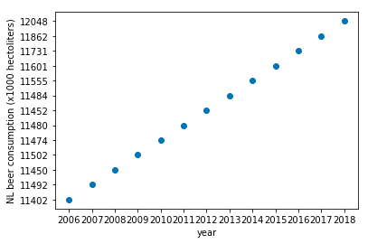

### CS Assignment

#### Karim Semin
#### 11285990

### Paper names:

Fantastic yeasts and where to find them: the hidden diversity of dimorphic fungal pathogens

An analysis of the forces required to drag sheep over various surfaces

The neurocognitive effects of alcohol on adolescents and college students

### Plot from 'istherecorrelation.csv'
.
